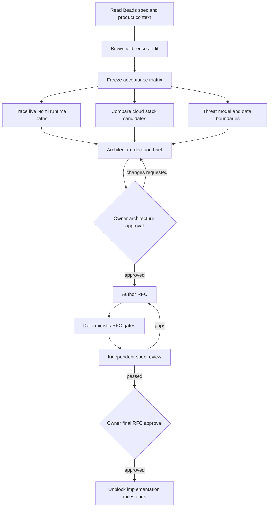

# Everville Media Platform RFC process map

```mermaid
flowchart TD
  A["Read Beads spec and product context"] --> B["Brownfield reuse audit"]
  B --> C["Freeze acceptance matrix"]
  C --> D1["Trace live Nomi runtime paths"]
  C --> D2["Compare cloud stack candidates"]
  C --> D3["Threat model and data boundaries"]
  D1 --> E["Architecture decision brief"]
  D2 --> E
  D3 --> E
  E --> F{"Owner architecture approval"}
  F -- "changes requested" --> E
  F -- "approved" --> G["Author RFC"]
  G --> H["Deterministic RFC gates"]
  H --> I["Independent spec review"]
  I -- "gaps" --> G
  I -- "passed" --> J{"Owner final RFC approval"}
  J -- "approved" --> K["Unblock implementation milestones"]
```
