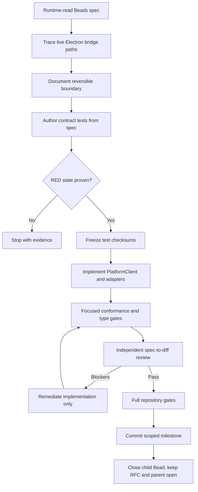

# Everville PlatformClient Milestone

```mermaid
flowchart TD
  A["Runtime-read Beads spec"] --> B["Trace live Electron bridge paths"]
  B --> C["Document reversible boundary"]
  C --> D["Author contract tests from spec"]
  D --> E{"RED state proven?"}
  E -- No --> X["Stop with evidence"]
  E -- Yes --> F["Freeze test checksums"]
  F --> G["Implement PlatformClient and adapters"]
  G --> H["Focused conformance and type gates"]
  H --> I["Independent spec-to-diff review"]
  I -- Blockers --> J["Remediate implementation only"]
  J --> H
  I -- Pass --> K["Full repository gates"]
  K --> L["Commit scoped milestone"]
  L --> M["Close child Bead; keep RFC and parent open"]
```
