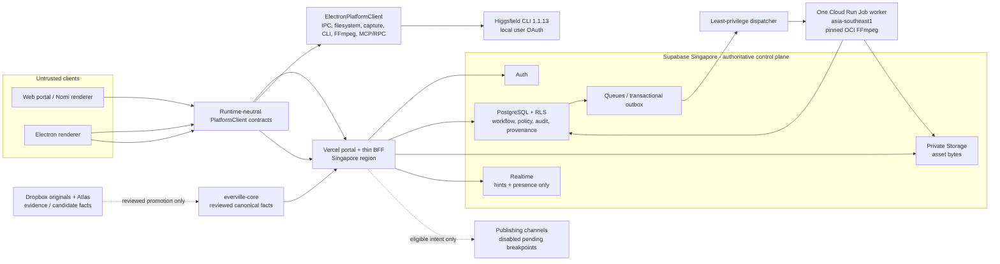

# Everville Media Platform Alpha Technical RFC

Status: **PENDING AT ARCHITECTURE BREAKPOINT; OPTION A IS THE REVIEWED RECOMMENDATION**

Working draft: 1.1 (untracked; no reviewed immutable version)

Date: 2026-07-17

Beads parent: `evmedia-r20.4`

Convergence review effect: `01KXQ0XPRAQFM58EEZFH8WBJ83`

## 1. Purpose, Scope, And Decision Discipline

This RFC defines a decision-ready online-first architecture recommendation for
the Everville Media Platform Alpha while preserving Nomi/Electron as a
first-class client. It is a pre-approval implementation contract for downstream
`evmedia-r20` work; it is not evidence
that the platform, security controls, migration, publishing, or pilot already
exist.

Statements in this RFC use these meanings:

- **EVIDENCE**: confirmed current repository behavior from the runtime audit or
  a stated source artifact. Evidence is not a target decision.
- **APPROVED**: explicitly selected by owner review recorded in section 2.
- **PROPOSED**: implementation detail to validate in the named downstream issue.
- **BREAKPOINT**: mandatory owner or release decision. The dependent capability
  remains disabled until it is resolved.
- **DEFERRED**: outside Alpha or intentionally postponed; it is not approved by
  omission.

This RFC covers every row in
`everville-media-platform-acceptance-matrix.md`. Current-state claims cite the
runtime audit rather than inferring behavior from the approved target. Pricing,
service limits, and region availability are dated research inputs from
`everville-media-platform-cloud-options.md` and must be refreshed at the
relevant operational breakpoint.

## 2. Owner Review And Decision Register

### 2.1 Owner review record

Architecture breakpoint result: **PENDING / BREAKPOINT**

Owner: Nikolay Asta

Owner response, verbatim: **"continue, make sure goal never stops itself"**

Response date: 2026-07-17

The response does not name Option A, any proposed decision ID, any rejected
alternative, or any downstream Beads change. It is therefore not recorded as
architecture approval. Option A remains the reviewed recommendation, and all
dependent authority changes, production releases, and publication capabilities
remain at their named breakpoints.

Reviewed evidence:

- `everville-media-platform-acceptance-matrix.md`, 24 frozen rows.
- `everville-media-platform-runtime-audit.md`, renderer-to-Electron evidence.
- `everville-media-platform-cloud-options.md`, normalized options and dated
  vendor research.
- `everville-media-platform-security-data.md`, threat model and logical model.
- `everville-media-platform-decision-brief.md`, presented Option A.
- `2026-07-16-everville-media-portal-workflow-draft.md`, product workflow.
- `bd show evmedia-r20.4` and the current `evmedia-r20` child issue graph.

Immutable evidence status:

| Evidence ID | Current state | Evidence required to resolve |
| --- | --- | --- |
| `EVID-ARCH-APPROVAL` | `PENDING` | Dated owner record that explicitly selects Option A, B, C, or a revised topology and lists the approved/rejected decision IDs. |
| `EVID-RFC-COMMIT` | `PENDING` | Reviewed immutable Git commit SHA containing this RFC and its review artifacts. The current artifact is untracked; a working-tree path is not immutable evidence. |
| `EVID-BEADS-RECON` | `PENDING` | Post-approval `bd show` evidence for every affected child proving acceptance criteria and dependencies were updated to the selected RFC. |

### 2.2 Reviewed Recommendation Register

| ID | Status | Owner/date | Decision | Alternatives considered | Rationale and evidence | Downstream |
| --- | --- | --- | --- | --- | --- | --- |
| P-01 | `PROPOSED` | Architecture owner, opened 2026-07-17 | Option A for Alpha: Vercel portal/thin BFF; Supabase Auth, PostgreSQL, private Storage, Realtime, and Queues in Singapore; one Cloud Run Jobs FFmpeg worker in `asia-southeast1`. | Self-hosted TypeScript platform; Google Cloud managed suite; browser-only rewrite; Electron-only rollout. | Option A scored highest for Alpha speed while retaining PostgreSQL, stable object identity, OCI worker, Electron, and exit boundaries. Cloud options and decision brief; approval evidence `EVID-ARCH-APPROVAL` is pending. | `evmedia-r20.5`, `.7`, `.8`, `.9`, `.10` |
| P-02 | `PROPOSED` | Architecture + desktop owner, opened 2026-07-17 | Electron remains a first-class `PlatformClient` implementation, including local/external projects, `nomi-local://`, browser capture, local credentials, MCP/RPC, and local FFmpeg continuity. | Browser-only replacement; Electron-only product. | Runtime audit proves these are privileged Electron paths and browser snapshot fallback is not parity. | `evmedia-r20.2`, `.3`, `.10` |
| P-03 | `PROPOSED` | Architecture owner, opened 2026-07-17 | Runtime-neutral `PlatformClient` contracts isolate product workflows from Electron and cloud adapters. | Parallel vendor-specific renderer implementations. | Preserves Upstream pullability and makes local/cloud conformance testable. | `evmedia-r20.2` |
| P-04 | `PROPOSED` | Architecture + data owner, opened 2026-07-17 | PostgreSQL is cloud workflow/audit authority; private Storage owns cloud bytes; stable Asset/AssetVersion IDs and digests join them. | Runtime URLs or provider URLs as identity; binary media in PostgreSQL. | Separates portable identity from location and preserves desktop resolution. | `evmedia-r20.5`, `.8` |
| P-05 | `PROPOSED` | Architecture + product owner, opened 2026-07-17 | Alpha uses optimistic revision locking and an edit lease; reviews, approvals, publications, provenance, and product audit are append-only. | Last-write-wins; field merge; CRDT. | Deterministic conflict handling is the reviewed Alpha recommendation; selection remains part of `EVID-ARCH-APPROVAL`. | `evmedia-r20.3`, `.5`, `.1` |
| P-06 | `PROPOSED` | Provider + security + architecture owner, opened 2026-07-17 | Higgsfield Alpha execution stays in Electron through the authenticated official CLI 1.1.13. No personal OAuth credential enters Vercel, Supabase, or Cloud Run. | Cloud CLI worker; official future API/SDK; undocumented direct HTTP. | Preserves evidenced behavior and credential custody. Cloud execution remains BP-04. | `evmedia-r20.7`, `.11` |
| P-07 | `PROPOSED` | Migration + architecture owner, opened 2026-07-17 | Migration is staged shadow import with per-project authority cutover and rollback; no local workspace or Dropbox original is rewritten in place. | Big-bang migration; uncontrolled bidirectional sync. | Preserves source authority and makes each stage independently verifiable. | `evmedia-r20.3`, `.5`, `.8`, `.10` |

### 2.3 Explicit non-approvals

No architecture approval currently exists. In particular, the owner response
does not approve the private Git host, CI/CD design,
production MFA actions, service-secret facility, role administrators, export or
publish initiators, final approvers, legal-review classes, direct publishing,
retention/legal hold, RPO/RTO, canonical promotion owners, post-publication fact
withdrawal handling, pilot inputs, migration cutover authority/window, or cost
ceilings. Section 17 is the authoritative register for these breakpoints.

### 2.4 Reviewed Non-Selection Recommendations

| ID | Status | Owner/date | Recommendation | Rationale and evidence |
| --- | --- | --- | --- | --- |
| NR-01 | `PROPOSED` | Architecture owner, opened 2026-07-17 | Do not select the all-Google Cloud managed suite for Alpha. | P-01 recommends the smaller/faster integrated Alpha control plane; GCP remains available for the FFmpeg worker and future reconsideration. |
| NR-02 | `PROPOSED` | Architecture + desktop owner, opened 2026-07-17 | Do not replace Nomi with a browser-only rewrite for Alpha. | Current projects, assets, secrets, capture, CLI, FFmpeg, events, and MCP/RPC require privileged Electron paths. |
| NR-03 | `PROPOSED` | Product + architecture owner, opened 2026-07-17 | Do not ship an Electron-only team platform as the full Alpha. | It cannot provide the proposed shared tenancy, authority, collaboration, approval, audit, or recovery control plane. |

## 3. Runtime Call Paths: Current Renderer-To-Electron Evidence

The production path is:

```text
React renderer -> window.nomiDesktop/DesktopBridge -> preload IPC
  -> Electron main handler -> local repository/native process/provider/session
  -> structured result or renderer event
```

The table is current-state **EVIDENCE**, not target design. Each row names its
privilege boundary, terminal side effect/source of truth, return, and evidence.

| Capability | Ordered live path | Terminal effect and return | Evidence |
| --- | --- | --- | --- |
| Projects/filesystem | `NomiStudioApp`/local project calls -> `projectRepository` -> `desktop.projects/workspaces` -> preload IPC -> main project/workspace handlers -> native or registered workspace repository and Electron dialog/shell | Project snapshot and directory under configured native root, or registered external folder retained in place; returns summaries/records/delete and workspace results. Browser localStorage fallback covers project JSON only. | Runtime audit sections "Shared Renderer" and 1; `src/workbench/project/projectRepository.ts`; `electron/projects/repository.ts` |
| Assets and `nomi-local://` | `assetUploadApi` -> asset IPC -> main/runtime -> `projectAssetStore.writeAsset/moveAssetFile` -> project bytes + sidecar; custom protocol -> project-relative resolver -> Electron `net.fetch(file:)` | Bytes under project `assets/imported` or `assets/generated`; DTO includes paths and desktop URL. `nomi-local://` is a local resolver, not portable identity. | Runtime audit section 2; `electron/assets/projectAssetStore.ts`; `electron/protocol/localProtocol.ts` |
| Credentials/catalog | `modelCatalogApi` -> catalog bridge -> synchronous preload IPC -> main catalog store -> Electron settings catalog; secret encode through `safeStorage` where available | Catalog and credential records in Electron settings; renderer receives catalog and key-presence metadata, never decrypted keys. Confirmed plaintext fallback when `safeStorage` is unavailable is a migration/security risk. | Runtime audit section 3; `electron/catalog/catalogStore.ts`; `electron/catalog/secrets.ts` |
| Generation/Higgsfield | Canvas runner -> `taskApi` -> task/grant IPC -> main idempotency/spend gate -> runtime model/key resolution -> HTTP mapping or Higgsfield process mapping -> provider/CLI -> localization into asset store -> provenance/result normalization | Normalized task state, project-local assets, trace/provenance, cached terminal result. Higgsfield spawns official local CLI and temporary inputs, then rejoins the same result path. | Runtime audit section 4; `electron/runtime.ts`; `electron/catalog/higgsfieldTransport.ts` |
| Browser capture | `NomiBrowserDialog` -> browser bridge IPC -> main `browserViews` -> sandboxed `WebContentsView`/session -> page selection, authenticated download, or `capturePage` -> temporary file -> project asset store | Persistent Electron browser session; captured/downloaded bytes become project assets; renderer receives view/capture/asset DTOs. | Runtime audit section 5; `electron/browser/core/browserViews.ts`; `electron/browser/media/browserViewMedia.ts` |
| FFmpeg/export | `TimelinePreview` -> `exportApi` -> export IPC -> durable `exportJobManager/store` -> filtergraph render or renderer WebM upload -> native FFmpeg -> atomic MP4 rename | Job manifest/state/log/result under `.nomi/jobs`; MP4 under project export path; returns job/backend/progress/result. No browser-only MP4 completion path exists. | Runtime audit section 6; `electron/export/exportJobs.ts`; `electron/export/ffmpegRunner.ts` |
| Events/provenance | Canvas gesture/vendor call -> event bridge IPC -> main event repository -> redaction/segmented JSONL/sidecars; task result -> provenance builder -> saved node/project snapshot | Best-effort `.nomi/events` and partial task provenance. Event IO failure is swallowed; author, actual cost, version, review, and approval history are absent. This is diagnostic, not product audit authority. | Runtime audit section 7; `electron/events/eventLogRepository.ts`; `electron/vendor/provenance.ts` |
| MCP/RPC canvas | MCP stdio or authenticated loopback `/rpc` -> dispatcher/capability core -> disk, renderer, or hybrid `ProjectGateway` -> WebContents bridge or project repository -> existing task/runtime path | Active canvas changes reach renderer then ordinary persistence; inactive/headless changes write snapshot; generation reuses credential/spend/provider/asset paths; structured MCP/RPC result. This is a Node/Electron seam, not browser-ready cloud auth. | Runtime audit section 8; `electron/capabilityCore/*`; `src/workbench/capability/capabilityApplyHandler.ts` |

Target handling: every row is preserved by `ElectronPlatformClient`; projects,
assets, jobs, collaboration, review, knowledge, and publication gain cloud
implementations. Browser capture and local MCP transport remain Electron-only in
Alpha and return `UNSUPPORTED_CAPABILITY` in the web client. Cloud FFmpeg is an
additional executor; Electron FFmpeg remains continuity and rollback.

The current `enc: "plain"` credential fallback is evidence, not an accepted
target behavior. BP-15 blocks every account-linked Alpha Electron release until
the fallback is disabled for that build, all existing plaintext records are
migrated or removed, and the at-rest plaintext gate in sections 16 and 18 passes.

## 4. Target Architecture: Components And Boundaries



| Boundary | Owner | Allowed dependency direction and source of truth |
| --- | --- | --- |
| Renderer/workbench | Nomi client team | Depends only on domain types and `PlatformClient`; no Electron, Vercel, Supabase, GCP, provider SDK, filesystem, queue, or secret types as product authority. |
| Contract package | Shared platform team | Domain-only stable identities, commands, queries, events, errors, auth context, and capabilities. Both adapters conform. |
| Electron adapter | Desktop team | May call IPC and local privileged subsystems. Local workspace remains source authority until project cutover; it never impersonates cloud authorization. |
| Vercel portal/BFF | Everville platform team | Browser edge, session validation, request validation, authorization prechecks, signed-media mediation. It does not run FFmpeg or hold personal Higgsfield credentials. |
| Supabase control plane | Everville platform/data/security owners | Auth plus authoritative PostgreSQL/RLS, private bytes, Realtime hints, queues/outbox after cutover. Database state, not Realtime or UI, is workflow truth. |
| Cloud Run worker | Media platform/operations | Opaque authorized jobs and least-privilege service identity only. Cannot change membership, policy, approval, canonicality, or publication eligibility. |
| Knowledge boundary | Knowledge owner | `everville-core` is reviewed canonical input. Dropbox/Atlas are read-only evidence/candidates. Promotion is separate and audited. |
| Product work ledger | Product/engineering | Beads is durable task truth. Babysitter journals are execution-only state. Neither is product state or audit evidence. |

## 5. Repository Boundaries And Upstream-Sync Boundaries

- The current public `origin` is upstream intake only. Everville tenancy,
  authorization, RLS, knowledge, brand policy, cloud adapters, deployment, and
  credentials must never be pushed there.
- Generic domain contracts and generic Electron adapter improvements may be
  upstream-compatible, but are contributed only through separately reviewed
  commits with no Everville policy or secrets.
- Everville product work lives on a private delivery surface selected at BP-01.
  The remote URL, host, merge authority, and CI/CD identity remain unconfigured
  until that breakpoint.
- Pull upstream into a dedicated integration branch; resolve generic contract
  changes; run domain, both-adapter, Electron, package, and migration checks;
  then deliberately promote into the private product branch.
- Provider IDs and persisted schemas do not fork to fit cloud SDKs. Adapters and
  versioned migrations absorb vendor differences.
- Durable job and product workflow state is PostgreSQL. Beads stores issue
  decisions/dependencies; Babysitter stores one execution journal. Neither may
  contain credentials, private source documents, or private investor data.

## 6. Runtime-Neutral PlatformClient Contract

All commands carry `request_id`, authenticated principal/session context,
organization and project/campaign scope where applicable, expected revision for
mutable state, and idempotency key for side-effecting retries. IDs are opaque
domain UUIDs, not paths or vendor URLs. Every adapter advertises capabilities.

Shared error families are `UNAUTHENTICATED`, `FORBIDDEN`, `NOT_FOUND` without
existence leakage, `CONFLICT`, `POLICY_BLOCKED`, `BUDGET_BLOCKED`,
`VALIDATION_FAILED`, `PROVIDER_FAILED`, `RETRYABLE`, `UNAVAILABLE`, and
`UNSUPPORTED_CAPABILITY`. Safe errors include a correlation ID and never expose
secrets, raw private prompts, cross-tenant metadata, or unredacted provider
payloads.

| Contract | Operations and input/output identity | Authorization and errors | Side effects; Electron vs cloud responsibility |
| --- | --- | --- | --- |
| `IdentityClient` | `getSession`, `listMemberships`, `listCapabilities`, `getAuthority(project_id)` -> principal, scopes, policy version, authority marker | Auth is not authorization; inactive membership is `FORBIDDEN` | Electron reports local capabilities only; cloud derives Supabase session/membership/RLS context. |
| `ProjectClient` | list/read/create/update revisions; import/export snapshot; input project/campaign IDs and expected revision; output immutable revision ID/digest | Scoped membership/classification; stale revision is `CONFLICT` | Electron reads/writes native/external workspace snapshots pre-cutover; cloud owns shared revisions post-cutover. |
| `AssetClient` | reserve Asset ID; create/version/upload/resolve/download/derive; IDs and digests in/out | Current object policy; denied lookup does not reveal existence | Electron owns local bytes/sidecars and resolves `nomi-local://`; cloud owns private objects, signed access, quarantine, versions, provenance. |
| `CatalogClient` | list vendor/model/workflow/voice IDs, schemas, capabilities, health, credential metadata | Classification/provider policy; no secret reads | Electron owns local catalog/credential status and Higgsfield sync; cloud owns approved shared catalog and credential references. Display localization never changes IDs. |
| `JobClient` | estimate, submit, get/list, wait/subscribe, cancel, retry; job/attempt/result/asset-version IDs | Policy, budget, provider, actor, immutable auth snapshot; typed provider/retry errors | Electron runs local provider/CLI/FFmpeg adapters; cloud records durable job, dispatches approved cloud work, and commits outputs/cost/audit. |
| `CaptureClient` | create/navigate/capture/import by project ID -> source metadata and AssetVersion ID | Project/classification/source policy | Electron-only for Alpha using isolated `WebContentsView`; web returns `UNSUPPORTED_CAPABILITY` and may use ordinary authorized upload. |
| `CollaborationClient` | presence, assign, acquire/renew/release edit lease, submit revision, resolve conflict | Membership, role, classification; stale revision/lease is `CONFLICT` | Electron caches/syncs; cloud is authority. Realtime carries hints/presence, never committed content. |
| `ReviewClient` | submit, review, approve/reject/revoke, evaluate eligibility -> immutable record IDs and bound digests | Named scoped role, separation policy, exact version/policy snapshot | Clients render commands/projections; cloud transactionally owns requirements, reviews, approvals, invalidation, audit. |
| `KnowledgeClient` | build/read/check freshness of pack by project/campaign/role/purpose -> immutable pack revision/fact digests | Minimum-necessary role/classification/canonicality checks | Electron/web consume packs only; cloud retrieves reviewed `everville-core`. Promotion is deliberately absent from this client. |
| `PublicationClient` | create intent, evaluate, queue, cancel, reconcile receipt/unpublish -> exact version, channel/account, receipt | Server-only predicate and BP-06/BP-07; ineligible is `POLICY_BLOCKED` | Electron export cannot mark publication. Cloud path remains disabled until breakpoints and release gates pass. |
| `AuditMigrationClient` | inspect audit; stage/reconcile/cut over/rollback migration by run/batch/source/target IDs | Privileged scoped roles; migration service cannot approve/publish/promote | Electron supplies source and diagnostics; cloud owns product audit, migration journal, backup and restore records. |
| `AutomationClient` | list projects/models; read/apply canvas; typed generate | Local MCP token is never cloud identity; cloud use requires BP-05 | Electron adapts existing MCP/RPC. No cloud transport in Alpha until tenant auth, project scope, spend confirmation, and concurrency are approved. |

Every current capability in section 3 maps to one contract above. No browser
adapter may silently fall back to fake local state for an unsupported privileged
operation.

## 7. Data Model: Tenancy, Authentication, RLS, And Logical Data

### 7.1 Invariants

- Supabase Auth establishes a principal; PostgreSQL application records and RLS
  establish authority. Every tenant row has immutable `organization_id`.
- Brand, project, campaign, and collaborator scope may narrow access but never
  widen organization access. Cross-tenant requests deny without existence
  leakage and emit a safe audit event.
- RLS is enabled on every exposed product table and Storage object row. Service
  role credentials are worker/server-only and never enter browser, renderer,
  project files, logs, analytics, Beads, Babysitter, or source control.
- Client-supplied organization, role, classification, ownership, cost,
  canonicality, approval, or publication readiness is ignored/rejected; server
  joins derive it.
- Role assignments are scoped, time-bounded where applicable, granted by an
  authorized different principal, and cannot self-escalate.
- Classification is an additional gate. Unknown policy, provenance, audit
  failure, or canonical status fails closed.

### 7.2 Role/action baseline

`C` means allow only after current scope, classification, state, policy, and
separation checks pass; `D` means deny. `BP` names a still-mandatory policy
decision, so the operation remains disabled until resolved.

| Operation | Standards Owner | Producer | Creator | Conditional reviewer | Publishing service |
| --- | --- | --- | --- | --- | --- |
| View scoped content | C | C | C | C | C, exact payload only |
| Create campaign/brief | D | C | D | D | D |
| Edit production content | D unless separately assigned | C | C | D | D |
| Change standards | C | D | D | D | D |
| Submit version | D unless creator/producer role | C | C | D | D |
| Producer review | D | C, separation applies | D | D | D |
| Brand approval | C, separation applies | D | D | D | D |
| Conditional approval | C only when named | C only when named | D | C, named requirement | D |
| Export | `BP-06` | `BP-06` | D | D | D |
| Initiate publish | D | `BP-06` | D | D | D |
| Execute publish | D | D | D | D | C only for eligible intent and `BP-07` |

### 7.3 Classification baseline

| Class | View/create/edit | Standards/review/approve | Export/publish/provider |
| --- | --- | --- | --- |
| Public | C for scoped members while draft | Role matrix + canonical facts + frozen policy | C only after all approvals; direct channels disabled until BP-07 |
| Partner | C for explicit scoped members | Role matrix; recipient/purpose policy | No public URL; approved recipient/provider only; BP-06/BP-07 |
| Investor | Explicit project + Investor grant | Canonical-fact rule and required business/legal policy | No public URL by default; BP-06/BP-07 and investor policy |
| Internal | Active organization + project scope | Role matrix | External provider/export denied unless explicit policy; publication D |
| Restricted | Explicit resource allowlist; no broad inheritance | Named reviewers and exception policy | Provider, local sync, export, publication D unless separately approved exception at BP-06/BP-07 |

Raising classification applies immediately. Lowering it requires authorized
review and reason, revokes affected signed URLs, invalidates packs/approvals,
and re-evaluates retention and publication.

### 7.4 Logical model

All mutable tenant entities have immutable `organization_id`, actor/timestamps,
and revision. Immutable records use digests and predecessor/supersession links.

| Aggregate | Required entities and facts |
| --- | --- |
| Identity/tenancy | `Organization`, `Principal`, `Membership`, scoped `RoleAssignment`, policy/retention references |
| Brand/project | `Brand` with Brand Kit/standards revision; `Project` with classification/source references; `Campaign` with audience, objective, channels, languages, budget/currency/owner, deadline, classification |
| Creative workflow | immutable `BriefRevision`, `StoryboardRevision`; `Deliverable` with channel/language/format/lifecycle/current submitted version |
| Knowledge | `KnowledgeSource`; candidate/canonical `KnowledgeFactRevision`; immutable scoped `KnowledgePackRevision` with fact IDs/digests, policy, actor, expiry/staleness |
| Assets | stable `Asset`; immutable `AssetVersion` with object reference, digest, size/MIME, author, predecessor/derivation, source, classification, quarantine/scan state |
| Jobs/provenance | `GenerationJob` with provider/model, credential ref, policy/auth snapshot, inputs, idempotency, expected/actual cost, budget reservation, state/error; `ProvenanceRecord` with prompt digest/protected payload, model/provider/version, parameters/seed, sources, author/agent/job, provider request ID, cost/time |
| Review/approval | frozen `ReviewRequirement`; immutable `Review` and `Approval` bound to asset/brief/pack/policy digests, with outcome, actor, reason, revocation/invalidation link |
| Publication | `PublicationIntent`, `PublicationAttempt`, `PublicationReceipt` with exact version/channel/account/idempotency, status, blocks, external receipt, reconciliation/unpublish state |
| Governance/operations | append-only `AuditEvent`; `RetentionPolicy`, `LegalHold`; `MigrationRun/Item`; `BackupManifest`, `RestoreRun` |

Before cutover, local snapshots/bytes are authority and cloud imports are shadow
records. After an explicitly authorized per-project cutover, PostgreSQL and
private Storage are authority; Electron/web copies are revisioned projections.
Missing legacy provenance remains `unknown`/`unverified` and is never invented.

## 8. Asset Storage: Stable Assets And Private Objects

- `Asset.id` is stable logical identity. `AssetVersion.id` identifies immutable
  bytes and metadata. Neither contains a path, bucket vendor, signed URL,
  provider URL, CDN URL, or `nomi-local://`.
- PostgreSQL stores tenant/project ownership, classification, version lineage,
  private bucket/key, content digest, size, MIME, storage generation, scan state,
  authorship, derivation, provenance, cost, and approval relationships.
- Supabase private Storage owns cloud bytes. Upload enters quarantine through a
  short-lived purpose-bound signed URL; server/worker validates tenant, digest,
  MIME, size, and scan result before promoting the version.
- Downloads, exports, and publication renditions require current authorization.
  Signed URLs are short-lived transport grants and are never persisted as
  identity. Public locators exist only in successful Publication receipts.
- Electron maps the same IDs to project-relative files and may present
  `nomi-local://`; absolute paths and this scheme remain local projection data.
- Every generated version must commit model, prompt digest/protected prompt,
  sources/Knowledge Pack, author/agent, provider request, actual and expected
  cost, parameters, timestamps, and approval linkage before job success.
- Database backup alone is insufficient because Supabase database backups do
  not include Storage bytes. Object manifests/replication and coordinated
  restore are mandatory at BP-09.

## 9. Generation Jobs: Durable Generation And Export Execution

Under proposed Option A, PostgreSQL is the job ledger and Supabase
Queues/transactional outbox provides at-least-once delivery. Queue order and
Realtime messages are never workflow truth. The proposed dispatcher starts one
pinned Cloud Run Job worker for FFmpeg. Alternative topologies must implement
the same state and evidence contract.

Submission persists `max_attempts`, `job_deadline_at`, `attempt_timeout`,
`lease_ttl`, the deterministic backoff schedule, idempotency scope, budget
reservation, and immutable policy/auth snapshot before queue delivery. These
values cannot be widened by a worker or retry. Terminal states never re-enter a
nonterminal state.

```text
DRAFT -> POLICY_CHECK -> COST_ESTIMATED -> CONFIRMATION_REQUIRED? -> QUEUED
QUEUED -> LEASED -> RUNNING -> RESULT_VALIDATION -> SUCCEEDED
LEASED | RUNNING | RESULT_VALIDATION -> RETRY_WAIT -> QUEUED
LEASED | RUNNING -> CANCEL_REQUESTED -> CANCELLED | RESULT_VALIDATION
nonterminal -> FAILED | CANCELLED | EXPIRED | POISONED
```

| Transition | Actor | Deterministic preconditions | Durable side effect | Terminal? |
| --- | --- | --- | --- | --- |
| `DRAFT -> POLICY_CHECK` | Producer/Creator via API | Authenticated scoped actor; input IDs exist; idempotency key has no conflicting payload | Create job with request, tenant/project/input context, retry bounds, and deadline | No |
| `POLICY_CHECK -> COST_ESTIMATED` | API policy service | Current classification/model/provider/source policy passes | Store immutable policy/auth snapshot, expected cost, budget owner/currency | No |
| `POLICY_CHECK -> FAILED` | API policy service | Deterministic policy denial or invalid input | Store safe typed reason and audit; make no provider call | Yes |
| `COST_ESTIMATED -> CONFIRMATION_REQUIRED` | API | Cost exceeds the persisted auto-approved rule or policy requires a human | Record confirmation requirement; make no provider call | No |
| `COST_ESTIMATED/CONFIRMATION_REQUIRED -> QUEUED` | Authorized actor/API | Required confirmation and budget reservation pass; deadline remains open | Transactionally write one outbox record and audit event | No |
| `QUEUED -> LEASED` | Dispatcher/executor | Message matches job and attempt; no active lease; `attempt_no < max_attempts`; deadline open | Atomically acquire lease token/expiry and record executor/image/CLI identity | No |
| `LEASED -> RUNNING` | Electron or Cloud Run executor | Lease token matches; membership/policy/budget/credential recheck passes | Record attempt/start and idempotent external-call identity or FFmpeg plan | No |
| `RUNNING -> RESULT_VALIDATION` | Executor | Provider/FFmpeg returns, or a cancellation arrives after an irreversible call and requires reconciliation | Persist redacted result reference, digest, actual cost/resources/transfer and cancellation flag | No |
| `RESULT_VALIDATION -> SUCCEEDED` | Authoritative API transaction | Output passes digest/type/scan/policy checks and audit/outbox can commit | Commit AssetVersion, complete provenance/actual cost/audit, release budget delta | Yes |
| `LEASED/RUNNING/RESULT_VALIDATION -> RETRY_WAIT` | Authoritative API | Error class is retryable; no cancellation; `attempt_no < max_attempts`; deadline remains open; external idempotency/reconciliation is known | Close attempt, invalidate lease, calculate persisted `retry_not_before`, retain reservation, append failure/audit | No |
| `RETRY_WAIT -> QUEUED` | Sweeper/API | Clock is at/after `retry_not_before`; deadline open; attempts remain; no cancellation | Create exactly one next-attempt outbox record under the original job ID | No |
| `LEASED/RUNNING -> CANCEL_REQUESTED` | Authorized actor/API | Job has an active attempt | Persist request and actor/reason; prevent new leases; signal executor | No |
| `DRAFT/POLICY_CHECK/COST_ESTIMATED/CONFIRMATION_REQUIRED/QUEUED/RETRY_WAIT -> CANCELLED` | Authorized actor/API | No active or irreversible external side effect | Invalidate queued delivery, release reservation, append terminal audit | Yes |
| `CANCEL_REQUESTED -> CANCELLED` | Executor/API | Executor proves abort before irreversible side effect and no output exists | Close attempt, release reservation, append terminal audit | Yes |
| `CANCEL_REQUESTED -> RESULT_VALIDATION` | Executor/API | Provider accepted an irreversible request or output may exist | Reconcile result/cost; preserve cancellation request; never claim cancellation | No |
| `LEASED/RUNNING/RESULT_VALIDATION -> FAILED` | Authoritative API | Safe error is non-retryable, retry budget is exhausted, or result validation fails deterministically | Close attempt, record typed error/evidence, release reservation per policy | Yes |
| `nonterminal -> EXPIRED` | Sweeper/API | `job_deadline_at` passed and no unresolved external side effect exists | Invalidate lease/messages, release reservation, append deadline evidence | Yes |
| `QUEUED/LEASED -> POISONED` | Dispatcher/API | Envelope cannot be reconciled to persisted schema, tenant, job, attempt, or idempotency invariants | Quarantine payload reference, invalidate lease/message, release reservation, page owner, append terminal audit | Yes |

A poison message that cannot identify a valid job creates a separate immutable
`PoisonMessageRecord`; it never fabricates a job transition. An operator retry
of `FAILED`, `EXPIRED`, `CANCELLED`, or `POISONED` creates a new `DRAFT` job with
`retry_of_job_id`, new authorization/policy/budget checks, and a new idempotency
scope. Automatic retry only uses `RETRY_WAIT`; it is finite by construction.

Every lease expiry uses an atomic compare of job ID, attempt ID, and lease token.
If retry bounds remain, it transitions to `RETRY_WAIT`; otherwise it transitions
to `EXPIRED`. A deadline reached after an external side effect remains in
`RESULT_VALIDATION` for reconciliation and operator escalation rather than
being falsely labelled expired. Success never means approved or published.

Cloud FFmpeg receives object references, a render manifest, and scoped signed
access; writes a partial output; validates; atomically promotes the completed
object; and records image digest, command-plan hash, duration, resources, bytes,
and result digest. Electron FFmpeg conforms to the same artifact contract.

## 10. Higgsfield Capability Governance

Installed **EVIDENCE**: official `/opt/homebrew/bin/higgsfield`, version 1.1.13,
build `11bfed2733870848f3489335c1bf3d91961ccd4a`, built 2026-07-11. The inventory
was captured on 2026-07-17. Installation does not approve portal exposure.

| Surface | Full installed capability | Alpha disposition |
| --- | --- | --- |
| Auth/account/workspace | auth login/logout/token; account status/transactions; workspace list/set/status/unset | Local login/status/workspace metadata only. Token output prohibited from automation. |
| Catalog | image/video/text/audio model list/get; workflow list/get; voices list/get | Typed read/sync enabled; IDs stable and never localized. |
| Upload/generation | image/video/audio upload create/list; generate create/cost/get/list/wait/workflow; image, video, audio, text, 3D | Typed Electron adapter enabled with policy, budget, provenance, status/result validation. |
| Soul | Soul ID create/get/list/wait, Soul 2.0 and Cinematic training | BP-16 blocks exposure pending consent, source rights, retention, budget, training-output classification, deletion, and approval policy. |
| Marketing Studio | ad formats/references, avatars, Brand Kits, DTC ads, hooks, products, settings, web products | BP-17 blocks exposure pending typed Brand/Campaign/AssetVersion mapping, credential scope, publishing boundary, and provenance policy. |
| Product pipelines | product photoshoot with modes/variants/enhancement/brand context; marketplace main/secondary/A+ modules/full sets | BP-18 blocks exposure and pilot inclusion pending variant/cost/provenance/approval mapping; BP-10 must also select it for the pilot. |
| Website | contest/create/deploy/list/publish/rename/repo-access/status; read-only database query/rows/schema/tables; secret set/list/delete | DF-01/DF-02 `DEFERRED`; deploy/publish/repository/database/secret operations require separate security and product approval. |
| Game | deploy and publish | DF-01 `DEFERRED` outside Alpha pilot. |
| Automation | global JSON/no-color; wait timeout/interval; version/build data | Required for typed invocation, pinned version/checksum, parsing, cancellation, and observability. |

The platform never exposes arbitrary CLI argument concatenation, undocumented
HTTP calls, `auth token`, repository access, or secret administration. For
Alpha, an authenticated Electron executor leases an authorized cloud job,
invokes the local CLI with typed arguments and `--json`, and returns normalized
status, AssetVersion, provenance, and cost to cloud authority. Personal OAuth
credentials stay local and are not synchronized. Cloud Higgsfield execution is
disabled until BP-04 approves vendor-supported non-personal credentials,
Everville workspace/billing custody, rotation, redaction, and parity tests.

## 11. Collaboration Semantics

- Committed PostgreSQL revisions are authoritative. Briefs, storyboards,
  deliverables, project snapshots, and asset metadata require expected revision.
  A stale write returns `CONFLICT` with the current safe revision.
- Freeform canvas/storyboard editing uses one scoped, expiring edit lease plus
  optimistic revision rejection for Alpha. Lease loss never causes silent
  overwrite. Realtime broadcasts invalidation and lease/presence hints only.
- Reviews, approvals, publications, provenance, and audit are append-only.
  Correction uses supersede, revoke, invalidate, or a new revision.
- Assignment and workflow transitions are durable authorized commands. Presence
  contains only online/active-document state and may disappear without data loss.
- Offline Electron edits become a proposed revision at reconnect. The client
  compares base/current revisions and asks for explicit resolution; it never
  overwrites cloud authority with last-write-wins.
- CRDT and field merge are DF-03 `DEFERRED` unless pilot conflict evidence justifies a
  new owner-approved architecture decision.

Campaign walk: Producer creates Campaign/Brief -> system freezes Knowledge Pack
-> Producer selects Brand Kit/template/deliverables and assigns Creator ->
Creator leases/edits and submits AssetVersion -> automated QA and cost/provenance
records -> Producer appends review -> Standards Owner appends brand approval ->
named conditional reviewers append required approvals -> authoritative service
evaluates exact version/policy -> export or disabled-until-approved publication
intent -> immutable asset/provenance/approval/publication archive.

## 12. Knowledge Packs: everville-core, Atlas, And Dropbox Boundary

- `everville-core` is the reviewed canonical knowledge source. Nomi reads scoped
  canonical revisions; it never automatically promotes knowledge.
- Dropbox originals are source-of-truth evidence outside `_agent/`. Folder-local
  Atlas OCR/extractions/indexes/handoffs stay in that folder's `_agent/` and are
  candidate evidence. Before use, ingestion captures source locator/digest and
  the relevant `_agent/handoffs/latest.md` and `_agent/validation_report.md`.
- OCR, extraction, summaries, and generated statements create immutable
  `candidate` fact revisions. They remain visibly unconfirmed and cannot satisfy
  Public or Investor publication citations.
- Promotion is a separate audited command by an owner selected at BP-08. It
  creates a new canonical revision; ingestion, retrieval, generation, ordinary
  review, and publication cannot invoke promotion.
- Knowledge Packs are immutable snapshots scoped to organization, project,
  campaign, role, purpose, and classification, with exact fact revision IDs and
  digests. Whole-company prompt loading is denied.
- Superseded/withdrawn/reclassified facts stale affected packs and block pending
  publication. Already-published response remains BP-08.

## 13. Review, Approval, Provenance, And Publication

`AssetVersion` moves `QUARANTINED -> DRAFT -> SUBMITTED -> IN_REVIEW ->
APPROVABLE` or `CHANGES_REQUIRED/REJECTED`. A successful publication is a
receipt, not a mutable flag on the asset.

Approval binds exact `asset_version_id`, content digest, Brief revision,
Knowledge Pack revision, approval-policy snapshot, requirement, approver role,
and timestamp. Any bound change invalidates readiness. Rejection, revocation,
and invalidation append records.

Publication intent moves `DRAFT -> BLOCKED|ELIGIBLE -> QUEUED -> PUBLISHING ->
SUCCEEDED|FAILED|PARTIAL|CANCELLED`. In one authoritative transaction,
eligibility requires authenticated authorized initiation, valid tenant/project/
channel/account, exact immutable bytes/digest, classification/provider/channel
permission, completed media/brand/language/model/restricted-term QA, frozen
requirements with every mandatory approval, no blocking decisions, canonical
Public/Investor facts, budget/export/legal-hold checks, and a committable audit +
outbox record. The worker rechecks before any external side effect and stores a
receipt/reconciliation result.

Direct publication stays disabled until BP-06, BP-07, BP-08, BP-09, and BP-13
plus the security release gates pass. A pilot channel additionally requires
BP-10. Export does not imply publication.

## 14. Deployment, Environments, And Target Architecture Alternatives

Development, preview/staging, and production use separate Vercel/Supabase
projects, databases, buckets, secrets, provider workspaces, service identities,
and telemetry labels. Preview uses no production data or provider credentials.
Electron is independently packaged and verified against the selected cloud
environment; desktop-only workflows remain available according to authority.

| Criterion | A: proposed Vercel + Supabase + Cloud Run | B: self-hosted | C: Google Cloud managed |
| --- | --- | --- | --- |
| Alpha delivery | Fastest integrated auth/RLS/storage/realtime; narrow worker addition | Slowest; builds and operates full stack | Moderate; more service assembly |
| Tenant/security | Direct Auth-to-RLS; still requires two-tenant tests | Flexible, highest owned policy burden | Strong IAM/service controls; app roles/RLS still required |
| Jobs/media | Supabase queue + one Cloud Run FFmpeg worker | Maximum runtime control | First-class managed Jobs/Tasks |
| Operations/recovery | Lowest platform surface; cross-vendor logs and DB/object restore | Highest HA/on-call/patching burden | Strongest managed single-cloud operations |
| APAC/data | Singapore control plane and `asia-southeast1` worker | Operator-selected | Singapore full stack |
| Cost shape | Lowest dated Alpha floor; variable media egress/logs/provider spend | Cheap demo misleading; labor/HA dominate | Higher always-on Cloud SQL floor |
| Portability | PostgreSQL + stable objects + OCI worker provide tested exit | Highest primitive control | More IAM/service coupling |
| Electron/upstream | Preserved through neutral contracts/private commits | Same if interfaces remain neutral | Same if Google types stay behind adapters |
| Disposition | P-01 `PROPOSED` and recommended for Alpha; BP-00 unresolved | DF-04 `DEFERRED` exit direction | Credible alternative at BP-00; NR-01 proposes not selecting it for Alpha |

Dated 2026-07-17 cost input: Vercel Pro was approximately USD 20 per developer
per month and Supabase Pro started around USD 25 per month, before transfer,
storage, Realtime, logs, backup/PITR, Cloud Run, and provider spend. This is not
a budget approval. Refresh pricing and measure cross-vendor egress at BP-12.

## 15. Migration, Cutover, And Rollback

| Phase | Entry/action | Exit evidence | Rollback and authority |
| --- | --- | --- | --- |
| M0 contracts/inventory | Electron sole authority; enumerate native `~/Documents/Nomi Projects`, registered workspaces, schema versions, bytes, hashes, missing provenance, unsupported states | Contract parity; signed/countable read-only inventory; no source writes | Remove unused adapters/staging; source untouched |
| M1 identity/tenancy | Create test organizations, memberships, stable mappings, RLS | Deterministic mappings; collisions resolved; two-tenant/role/class denial suite | Disable cloud login and delete test data; local untouched |
| M2 shadow metadata/assets | Versioned idempotent batch import to non-authoritative records/private objects | Counts, relationships, source/target schema mapping, size/digest and provenance reconciliation | Delete/quarantine by batch ID; retain mapping journal and all source data |
| M3 dual validation | Read cloud projection; no uncontrolled dual writes; restore rehearsal | Zero unexplained differences; negative auth; signed asset and restore evidence | Disable cloud reads/sync; desktop-only authority |
| M4 pilot cutover | BP-11 owner freezes/checkpoints source, applies delta, records per-project authority marker | Final revision/digests, online/offline conflicts, reviews/approvals/export, audit, backup/restore all pass | Freeze cloud writes; export latest snapshot/assets; reconcile; owner-authorized authority reversal within approved window |
| M5 cloud FFmpeg | Enable pinned worker per approved deliverable | Golden files, timeout/cancel/retry/cost/security tests and Electron parity | Disable dispatcher; preserve queue state; execute through Electron |
| M6 publication | Only after all publishing breakpoints/gates | Dry-run and real channel receipt/reconciliation/unpublish evidence | Disable channel; compensate/unpublish where supported; irreversible side effects require prior owner acceptance |

Every transform has a version, fixture, idempotency test, validation, and inverse
or compensating procedure. Schema expansion precedes new writers. Unknown fields
are preserved or quarantined. No migration invents approval, canonicality,
classification, author, cost, or provenance. Rollback names trigger, authority,
last-known-good deployment/schema/policy/desktop version, writes since release,
compensation, and completion evidence. It never deletes authoritative source or
audit/provenance.

Deployment rollback, database/schema rollback, object rollback, RLS/auth policy
rollback, worker rollback, and Electron release rollback are independent; a
Vercel traffic rollback does not revert Supabase data or external side effects.

### 15.1 Rollback Operational Contract

Before production, the selected delivery repository must provide a reviewed,
noninteractive rollback entry point with this logical interface (the executable
name and platform adapter are chosen at BP-01):

```text
rollback <lane> --environment <env> --change <change_id> --to <immutable_lkg_id>
rollback <lane> --environment <env> --change <change_id> --verify
```

The release manifest records the exact command, immutable target identifiers,
actor, approvals, pre/post high-water marks, and evidence location. A runbook
that says only "redeploy" or "restore backup" does not pass RFC-14.

| Lane | Trigger | Executable procedure | Authority | Last-known-good selection | Intervening-write treatment | Required immutable evidence |
| --- | --- | --- | --- | --- | --- | --- |
| Portal/BFF deployment | P0/P1 regression, security control failure, error/SLO threshold, incompatible API contract | Freeze affected writes if compatibility is uncertain; invoke `rollback deployment ... --to <deployment_id>`; verify health, auth denial, read/write smoke, and correlation; reopen writes only after policy/data checks | Release commander; incident security lead may force disablement | Most recent production deployment that passed the same smoke suite and whose API/schema compatibility is recorded in the release manifest | Preserve writes in the authoritative database; quarantine requests accepted by a bad policy; replay only idempotent commands after review | `EVID-ROLLBACK-DEPLOYMENT: PENDING` with deployment IDs, command transcript, high-water marks, smoke output, authority, timestamps |
| Database/schema/data | Migration error, invariant violation, performance/availability threshold, restore mismatch | Stop new writers; capture WAL/transaction high-water mark and backup; run tested down/compensating migration to `<schema_digest>`; validate counts, constraints, RLS, audit, and app compatibility | Data rollback lead plus release commander; destructive compensation also requires recovery authority | Latest schema/data checkpoint with tested restore and forward compatibility recorded before release | Never discard accepted writes; transform forward, quarantine, or journal compensation by record ID; use point-in-time restore only into isolation before an authorized cutover | `EVID-ROLLBACK-DATA: PENDING` with migration/backup digests, before/after counts, write journal, restore/reconciliation output |
| Object storage/assets | Digest mismatch, cross-tenant policy exposure, orphan spike, failed promotion | Disable signing/promotion; select manifest generation; restore/copy immutable object versions; reconcile every DB AssetVersion to digest/size/MIME/object generation; revoke affected URLs | Storage operations lead plus security incident lead for exposure | Latest manifest whose DB checkpoint, object generations, and digest reconciliation all passed | Retain new objects under quarantine and retain DB references; merge only after digest/ownership validation; never overwrite immutable versions | `EVID-ROLLBACK-ASSETS: PENDING` with manifest/checkpoint IDs, reconciliation report, URL revocation evidence |
| Production RLS/auth policy | Cross-tenant test failure, unexpected allow/deny, session/MFA regression, privileged-key exposure | Enable maintenance deny for affected operations; capture policy/session high-water mark; invoke `rollback policy ... --to <policy_bundle_digest>` transactionally; revoke impacted sessions/URLs; run two-tenant and role/class matrices before reopening | Security incident lead and data policy owner; either may force deny-only mode | Latest signed policy bundle that passed production-equivalent RLS/auth tests and is compatible with current schema | Identify every write authorized between high-water marks; quarantine and re-authorize each under restored policy; do not delete audit/provenance; notify incident owner for disclosed reads | `EVID-ROLLBACK-POLICY: PENDING` with policy digests, session revocations, affected-write ledger, denial suite, authority/timestamps |
| Queue/worker | Duplicate spend, poison threshold, bad image, timeout/cancel failure, result mismatch | Disable dispatcher; invalidate active leases by token; reconcile external requests; invoke `rollback worker ... --to <image_digest>`; canary one job; resume by bounded queue cohort | Media Platform Operations duty lead | Latest pinned image digest passing golden files, replay/cancel/poison, cost, and asset contract tests | Preserve queue/job state; never blindly redeliver unknown external calls; reconcile by provider request/idempotency ID before requeue | `EVID-ROLLBACK-WORKER: PENDING` with image digest, lease invalidations, reconciliation, canary and queue cohort evidence |
| Electron release | Crash/security regression, migration corruption, `enc:plain` detection, account-link authorization failure, continuity test failure | Disable account linking/server capability for affected version; point the signed release channel to `<signed_artifact_digest>`; verify signature/install/launch/current projects; migrate only with tested forward-compatible transforms | Desktop release lead; security incident lead may block a version | Latest signed artifact that passed packaged installed-app, migration, IPC, protocol, secret-at-rest, and cloud compatibility gates | Never auto-downgrade project schemas or erase local/cloud writes; retain local deltas as proposed revisions and reconcile after a fixed client is installed | `EVID-ROLLBACK-ELECTRON: PENDING` with signed artifact/update-manifest digests, blocked-version rule, install smoke, delta reconciliation |
| Publication channel | Wrong account/content, policy/approval invalidation, partial/duplicate publish | Disable channel; stop new intents; reconcile receipts; execute supported unpublish/compensation by receipt; preserve public locator history and notify owners | Publishing Operations duty lead plus business/legal authority required by BP-06/BP-07 | Last approved channel adapter/configuration and exact approved AssetVersion; external content itself may be irreversible | Preserve all intents/attempts/receipts; record external changes; never relabel an irreversible side effect as rolled back | `EVID-ROLLBACK-PUBLICATION: PENDING` with receipts, channel actions, reconciliation and owner acceptance |

Each placeholder remains `PENDING` until it points to immutable reviewed evidence.
Production, production policy/RLS, and account-linked Electron release remain
blocked while their procedure, authority, LKG selector, or intervening-write
treatment is unimplemented or unrehearsed.

## 16. Security, Recovery, Observability, And Cost Guardrails

### 16.1 Release-blocking misuse cases

| Misuse case | Prevention | Required evidence |
| --- | --- | --- |
| Organization A reads/mutates B project, object, job, queue result, or restore | Server-derived tenant scope, RLS, Storage policy, opaque IDs, scoped service identity | Two-tenant API/RLS/object/job/restore denial tests without existence leakage |
| Restricted knowledge reaches unapproved model/provider | Classification/provider allowlist checked before secret or queue side effect | Policy denial and no-call/egress assertion |
| Browser/renderer obtains secret or sets authority flags | Server/main-only custody, schema allowlists, hostile IPC validation | Browser bundle/renderer/log scans; mass-assignment and malicious-renderer tests |
| Account-linked Electron stores a credential as `enc: "plain"` or leaks plaintext at rest | BP-15 migration, fail-closed secret storage, fallback removal, credential rotation, at-rest scan | Zero-plaintext migration report and packaged safeStorage-unavailable/install/upgrade/rollback tests; `EVID-PLAINTEXT-AT-REST` |
| Approval/publication bypass or post-approval byte change | Exact digest/policy binding, append-only decisions, transactional predicate | Invalidation, concurrent approval/publish, replay and audit-failure tests |
| Candidate Atlas/OCR fact becomes canonical/publication-safe | Separate candidate state and owner-only promotion | Candidate publication denial, stale-pack, promotion authorization tests |
| Signed URL/object substitution | Short expiry/purpose, private buckets, digest/MIME/size/quarantine | Expiry/replay, digest mismatch, MIME/size, public-access scans |
| Job replay, revoked actor, or budget race duplicates spend | Immutable auth snapshot + recheck, idempotency, lease, budget transaction | Replay/concurrency/revocation/poison/cancel tests |
| `nomi-local://` path escape | Project-relative resolver, sender/path checks | Traversal, symlink, encoded separator, wrong-project installed-app tests |
| Backup/restore loses or crosses tenant data | Encrypted manifests, tenant-scoped authority, DB/object/audit reconciliation | Isolated restore drill with counts, digests, referential and audit continuity |

Critical controls fail closed. An unimplemented critical control keeps the
environment/capability disabled; it is not ordinary deferred debt.

### 16.2 Account-Linked Electron Plaintext-At-Rest Gate

This gate applies before any Alpha Electron build may link an Everville account
or exchange cloud project data. It does not claim the current standalone desktop
already passes.

1. **Inventory without disclosure.** With credential writers stopped, a
   main-process migration tool enumerates every catalog/settings credential
   record and scans app-managed project snapshots, logs, diagnostics, temporary
   paths, export manifests, and update staging for `enc: "plain"`, known secret
   field names, and seeded canaries. It emits counts, path classes, file digests,
   scanner version, and timestamps, never secret values.
2. **Migrate or rotate.** If Electron `safeStorage` is available, each plaintext
   catalog record is encrypted, round-trip verified inside main, atomically
   replaced, and re-read before the original record is retired. Because storage
   media/backups may retain old bytes, credentials found in plaintext are rotated
   before account linking unless Security records immutable evidence that the
   old value was never usable outside the local machine. Unmigratable records
   are removed and require re-entry; they are never copied to a new plaintext
   file or ordinary backup.
3. **Disable fallback.** Account-linked builds remove the write/read fallback:
   unavailable `safeStorage` returns `SECRET_STORAGE_UNAVAILABLE`, disables
   credential-dependent execution and account linking, and writes no credential.
   Startup fails the account-link gate if any credential record still has
   `enc: "plain"` or an unknown encoding.
4. **Prove zero plaintext at rest.** Re-run the scanner after migration, app
   restart, credential create/update/delete, generation, diagnostics export,
   upgrade, and crash recovery. Pass requires zero plaintext credential records,
   zero seeded canaries outside encrypted storage, no secret in renderer/browser
   bundles or logs, and no unknown credential encoding.
5. **Rollback safely.** On failure, disable account linking and provider
   execution, preserve only nonsecret migration/audit evidence, rotate affected
   credentials, and return to the last signed Electron release that passed this
   gate. Rollback must not restore a plaintext credential or silently downgrade
   credential encoding.

Operational owner: Desktop Security Operations. Release authority: Desktop
release lead plus Security owner. Named principals are required by BP-14/BP-15.
Immutable evidence placeholder: `EVID-PLAINTEXT-AT-REST: PENDING` (scanner and
migration tool digests, zero-count report, rotated credential references,
packaged test run, signed artifact digest, reviewer/date).

### 16.3 Recovery

Minimum design: managed database backup plus independent encrypted logical dump;
versioned object manifest and replication/export to a separate account/provider;
restore into an isolated project; auth mapping, RLS, queue cleanup, object
digests, approvals, provenance, and audit reconciliation. Exact RPO/RTO,
retention, legal hold, cadence, backup owner, and recovery authority are BP-09.

### 16.4 Observability and audit

Every request/job carries correlation, organization, campaign, job, asset,
version, provider request, executor, deployment, attempt, and policy identifiers
where applicable. Required signals cover auth/denials, RLS decisions, queue age,
leases/retries/poison, provider status/latency/cost, FFmpeg image/plan/result
digests and resources, signed asset transfer/checksums, provenance, reviews,
approvals, publication, migration, backup/restore/rollback, and Electron sync.

Authoritative transitions write `AuditEvent` or transactional outbox in the
same transaction and fail closed. Product audit is distinct from Nomi JSONL,
provider/hosting logs, Beads, and Babysitter. OpenTelemetry is `PROPOSED` at
BP-13 as the cross-runtime transport; the retained sink is selected there.

Terminal workflow records have explicit operational ownership even while named
on-call principals and the retained sink remain BP-13:

| Terminal workflow | Required authoritative record | Operational owner | Reviewer-visible evidence |
| --- | --- | --- | --- |
| Generation/export `SUCCEEDED`, `FAILED`, `CANCELLED`, `EXPIRED`, `POISONED` | Job, attempt, result/error, cost/reservation, AssetVersion/provenance where applicable, AuditEvent | Media Platform Operations | Correlated job timeline, terminal reason, lease/retry/cancel/poison evidence, alert acknowledgement |
| Review/approval `APPROVED`, `REJECTED`, `REVOKED`, `INVALIDATED` | Immutable Review/Approval plus bound digests/policy and AuditEvent | Product Audit Operations | Decision reconstruction by actor/role/version/policy without Beads or Babysitter |
| Publication `SUCCEEDED`, `FAILED`, `PARTIAL`, `CANCELLED` | Intent, attempt, receipt/reconciliation/unpublish state, AuditEvent | Publishing Operations | Exact channel/account/version, receipt, retries, partial/compensating actions |
| Migration/cutover/rollback completion or failure | MigrationRun/Item, authority marker, reconciliation, rollback run, AuditEvent | Migration Operations | Source/target counts/digests, high-water marks, owner authorization, completion evidence |
| Backup/restore completion or failure | BackupManifest/RestoreRun, reconciliation, AuditEvent | Recovery Operations | Tenant scope, counts/digests, RPO/RTO measurement, cleanup and reviewer sign-off |
| Security denial/incident terminal disposition | Policy decision, affected-resource ledger, incident/audit record | Security Operations | Safe denial/incident timeline, policy version, containment and closure evidence |

### 16.5 Cost

Campaign creation records budget, currency, accountable owner, warning,
confirmation, and hard-denial thresholds. Automated QA includes expected cost.
Each job records expected provider cost before execution and actual provider
cost, worker duration/resources, storage/transfer bytes, and infrastructure
allocation after execution. Provider and infrastructure costs are separate.
Unknown/variable pricing remains an assumption. BP-12 approves the monthly
platform envelope and per-campaign thresholds.

## 17. Mandatory Breakpoints And Deferred Scope

All unresolved choices live here; none may be resolved only in narrative.

| ID | Status | Owner | Opened / due condition | Decision and alternatives | Rationale / evidence reference | Blocks; allowed work before resolution |
| --- | --- | --- | --- | --- | --- | --- |
| BP-00 | `BREAKPOINT` | Architecture owner + Nikolay Asta | Opened 2026-07-17; due before vendor-specific implementation or authority migration | Explicitly select Option A, B, C, or a revised hybrid and region; no implicit default | Decision brief, acceptance matrix RFC-12/22/23, Beads note; `EVID-ARCH-APPROVAL` pending | Blocks selected topology, vendor-specific production work, and RFC-24; runtime-neutral contracts/tests/reversible spikes may proceed |
| BP-01 | `BREAKPOINT` | Repository + delivery owner | Opened 2026-07-17; due before any private product push or deployment | Select private Git host/remote, merge/release authority, and CI/CD identity; alternatives are approved private hosts or no remote | Repository boundary and acceptance matrix RFC-02/12/21; no current private delivery evidence | Blocks push/deploy in `.10`; local contracts/tests may proceed, never push Everville work to public `origin` |
| BP-02 | `BREAKPOINT` | Security + operations | Opened 2026-07-17; due before production auth or shared provider secrets | Select session lifecycle, MFA actions, secret manager/KMS, rotation/recovery, privileged access; alternatives must fail closed | Security-data E-05/D-03 and RFC-06/15 | Blocks production auth/provider secrets in `.9/.10`; local/test identities and interfaces may proceed |
| BP-03 | `BREAKPOINT` | Product + security | Opened 2026-07-17; due before production onboarding | Name membership/classification administrators, scoped grants, separation rules and exceptions; alternatives are stricter deny-only policies | Product role requirements; security-data D-05; RFC-05/06 | Blocks final onboarding/authorization in `.9/.1`; default-deny model/tests may proceed |
| BP-04 | `BREAKPOINT` | Provider + security + architecture | Opened 2026-07-17; due before any cloud Higgsfield execution | Approve vendor-supported non-personal cloud credentials and billing/rotation/redaction/parity, or retain Electron-only execution | Runtime audit Higgsfield path; decision brief B-05; RFC-09 | Blocks cloud Higgsfield in `.7`; proposed typed Electron CLI continuity may be implemented and tested without claiming architecture approval |
| BP-05 | `BREAKPOINT` | Architecture + security | Opened 2026-07-17; due before cloud MCP/RPC | Approve cloud transport with tenant/project auth, spend confirmation and concurrency, or retain local-only MCP/RPC | Runtime audit U-10 and RFC-20 continuity evidence | Blocks remote automation; local Electron MCP/RPC continues |
| BP-06 | `BREAKPOINT` | Product/Standards/business | Opened 2026-07-17; due before export/publication authorization | Name export and publication initiators, final approvers, duty separation/classification exceptions, or keep operations disabled | Product open questions; security-data D-06/D-07; RFC-05/06/19 | Blocks export authorization and publication workflow in `.1/.11`; review model/tests proceed |
| BP-07 | `BREAKPOINT` | Product + legal | Opened 2026-07-17; due before direct publication | Select channels/accounts, mandatory legal-review classes/templates, reversible/unpublish behavior, or export-only Alpha | Product open questions; security-data publication predicate; RFC-14/15/19 | Direct publication stays disabled in `.1/.10/.11`; export-only dry runs may proceed after BP-06 |
| BP-08 | `BREAKPOINT` | Knowledge + legal/product | Opened 2026-07-17; due before production Knowledge Packs/publication | Name canonical promotion reviewers and response to superseded/withdrawn published facts; alternative is no production promotion/publication | Atlas/everville-core boundary; security-data D-10/D-14; RFC-11 | Blocks production Knowledge Packs/publication in `.1`; read-only candidate/canonical fixtures proceed |
| BP-09 | `BREAKPOINT` | Operations + compliance/business | Opened 2026-07-17; due before production/cutover | Approve RPO/RTO, retention/deletion/legal hold, backup owner, restore cadence/authority; alternative is nonproduction only | Security-data D-08/D-09 and backup contract; RFC-14/15 | Blocks production/cutover in `.10`; isolated backup/restore rehearsals proceed |
| BP-10 | `BREAKPOINT` | Product/business owner | Opened 2026-07-17; due before pilot entry | Select real campaign, team, Brand Kit/templates, channels/languages, class, budget, approvers, direct-publishing scope, success metrics, or defer pilot | Product candidate pilot/open questions; RFC-19 | Blocks `.11`; synthetic fixtures and paper trace proceed |
| BP-11 | `BREAKPOINT` | Migration + product owner | Opened 2026-07-17; due before each M4/M6 authority change | Authorize project cutover, rollback window, write authority and irreversible effects, or retain desktop authority | Security-data migration contract; RFC-13/14 | Blocks M4/M6 and production authority in `.3/.5/.8/.10`; shadow import/rehearsal proceeds |
| BP-12 | `BREAKPOINT` | Business + operations | Opened 2026-07-17; due before paid pilot launch | Approve monthly platform ceiling and campaign/provider warning, confirmation and denial thresholds, or keep paid execution disabled | Dated cloud-options pricing and RFC-17; refresh required | Blocks paid pilot in `.7/.10/.11`; measurement instrumentation proceeds |
| BP-13 | `BREAKPOINT` | Security + compliance + operations | Opened 2026-07-17; due before production audit acceptance | Select audit integrity, retained telemetry sink, privileged access, named terminal-record/on-call owners, incident process and retention; alternatives must preserve reconstruction | Security-data D-04; section 16 terminal-owner table; RFC-16 | Blocks production approval/publication/audit in `.1/.10`; local telemetry/failure injection proceeds |
| BP-14 | `BREAKPOINT` | Desktop + security | Opened 2026-07-17; due before account-linked packaged Electron | Approve IPC inventory/validation, cloud capability authorization, and main-renderer sandbox compatibility; alternative is standalone desktop only | Runtime audit coupling and security-data I-02/D-12; RFC-06/15/20 | Blocks account-linked Electron in `.2/.3/.10`; current local desktop and hostile-input tests proceed |
| BP-15 | `BREAKPOINT` | Desktop Security Operations + desktop release lead | Opened 2026-07-17; due before account-linked packaged Electron | Complete `enc:plain` migration/rotation and disable fallback, or keep account linking/provider execution disabled | Runtime audit secret fallback; sections 3/16.2; `EVID-PLAINTEXT-AT-REST` pending | Blocks account-linked Alpha Electron release in `.2/.3/.9/.10`; scanner/migration/package tests proceed |
| BP-16 | `BREAKPOINT` | Product + legal + security | Opened 2026-07-17; due before Soul exposure | Enable selected Soul training with consent/source/retention/deletion/budget/approval policy, defer it, or prohibit it | Higgsfield 1.1.13 inventory; section 10; RFC-09/15/19 | Blocks all Soul UI/API/automation exposure in `.7/.11`; typed inventory and denied-capability tests proceed |
| BP-17 | `BREAKPOINT` | Product + brand + security | Opened 2026-07-17; due before Marketing Studio exposure | Enable selected typed Marketing Studio surfaces, defer them, or prohibit them | Higgsfield inventory; Brand/Campaign/AssetVersion mapping requirement; RFC-04/09/19 | Blocks Marketing Studio UI/API/automation exposure in `.7/.11`; schema/provenance fixtures proceed |
| BP-18 | `BREAKPOINT` | Product + operations + security | Opened 2026-07-17; due before product-pipeline exposure or pilot inclusion | Enable named photoshoot/marketplace pipeline modes with variant/cost/provenance/approval rules, defer them, or prohibit them | Higgsfield inventory; section 10; RFC-08/09/17/19 | Blocks product-pipeline UI/API/automation in `.7/.11`; typed inventory/golden fixtures proceed |
| BP-19 | `BREAKPOINT` | Release + data + security + desktop operations | Opened 2026-07-17; due before production deployment/policy or account-linked Electron release | Implement and rehearse each applicable section 15.1 rollback lane, or keep the lane disabled | RFC-14 feedback; `EVID-ROLLBACK-*` placeholders pending | Blocks `.10` production release and affected `.11` pilot path; runbook tooling and nonproduction drills proceed |

| ID | Status | Owner/date | Deferred scope and alternatives | Rationale / evidence | Re-entry condition |
| --- | --- | --- | --- | --- | --- |
| DF-01 | `DEFERRED` | Product + security, opened 2026-07-17 | Higgsfield website/game deploy and publish; alternative is a separate approved product | CLI inventory exposes repository/publishing/security boundaries beyond media Alpha | Separate product, repository, publishing, credential, and security approval |
| DF-02 | `DEFERRED` | Security + provider owner, opened 2026-07-17 | Arbitrary Higgsfield command pass-through, token output, repository/database/secret administration; alternative is typed allowlisted operations | Prevents shell/credential/admin exposure from a media workflow | Typed use case and dedicated threat review |
| DF-03 | `DEFERRED` | Product + architecture, opened 2026-07-17 | CRDT or field merge; alternative is proposed edit lease/optimistic rejection | Lower Alpha complexity while preserving deterministic conflict rejection | Pilot evidence proves the selected lease/optimistic model inadequate and owner approves a replacement |
| DF-04 | `DEFERRED` | Architecture + operations, opened 2026-07-17 | Self-hosted production stack; alternative is recommended Option A or Option C | Highest owned HA/recovery/on-call burden in dated comparison | Approved exit trigger or deliberate operations capability decision |
| DF-05 | `DEFERRED` | Architecture + operations, opened 2026-07-17 | Multi-region active-active and GPU workers; alternative is one-region/CPU Alpha | No measured Alpha requirement yet | Measured availability/performance need plus cost/security approval |
| DF-06 | `DEFERRED` | Product + security, opened 2026-07-17 | Broad direct publishing beyond explicitly approved pilot channels; alternative is export-only or named channels | Channel credentials, policy and reversibility differ per integration | BP-06/BP-07 evidence and channel-by-channel acceptance |

Automatic knowledge promotion is prohibited, not deferred.

## 18. Verification: Current Acceptance Status And Deterministic Plan

Current status is documentation-contract status, not implementation completion:

| Row | Status | Current evidence / precise next evidence |
| --- | --- | --- |
| RFC-01 | `PASS` | Runtime Call Paths audit covers all required capabilities; re-run path inventory at implementation review. |
| RFC-02 | `PASS` | Repository Boundaries, owners, public origin, Beads and execution-state boundaries are explicit; BP-01 still blocks private delivery. |
| RFC-03 | `PASS` | PlatformClient catalog maps each runtime capability to identity/errors/auth/side effects; conformance tests remain downstream. |
| RFC-04 | `PASS` | Logical Data Model and authority/projection rules are complete; physical topology remains BP-00. |
| RFC-05 | `PASS` | Default-deny tenancy and role/class matrices are explicit; named administrators remain BP-03. |
| RFC-06 | `BLOCKED` | Auth provider/operations are BP-00/BP-02 and account-linked Electron requires BP-15 plus `EVID-PLAINTEXT-AT-REST`. |
| RFC-07 | `PASS` | Asset Storage identity, bytes, addressing, quarantine and provenance rules are explicit; vendor selection remains BP-00. |
| RFC-08 | `PASS` | Generation Jobs now define finite expiry, requeue, cancel, retry and poison transitions; downstream deterministic tests are required. |
| RFC-09 | `BLOCKED` | Higgsfield inventory and continuity are evidenced; target selection is BP-00/BP-04 and BP-16/17/18 block product exposure. |
| RFC-10 | `BLOCKED` | Collaboration workflow is complete, but proposed lease/optimistic semantics require explicit BP-00 selection. |
| RFC-11 | `PASS` | Knowledge Packs separate candidate/canonical use and promotion; BP-08 blocks named production owners/withdrawal response. |
| RFC-12 | `BLOCKED` | Deployment comparison is decision-ready; architecture selection, private delivery and CI evidence are BP-00/BP-01. |
| RFC-13 | `PASS` | Migration phases preserve authority, versioning, reconciliation and source files; BP-11 blocks cutover. |
| RFC-14 | `BLOCKED` | Rollback contract now names triggers, procedures, authority, LKG and writes; BP-19 and all `EVID-ROLLBACK-*` rehearsals remain pending. |
| RFC-15 | `BLOCKED` | Security model is complete, but BP-02/BP-14/BP-15 and critical release checks remain unresolved. |
| RFC-16 | `BLOCKED` | Observability records and operational role owners are explicit; named principals, sink and retained evidence remain BP-13. |
| RFC-17 | `BLOCKED` | Cost model is explicit; refreshed pricing and approved thresholds remain BP-12. |
| RFC-18 | `BLOCKED` | Required checks are defined, but RFC is untracked and `EVID-RFC-COMMIT` has no reviewed immutable SHA. |
| RFC-19 | `BLOCKED` | Pilot trace preserves all ten steps; named real inputs and success evidence remain BP-10. |
| RFC-20 | `BLOCKED` | Electron continuity contract is complete; account-linked release requires BP-14/BP-15/BP-19 and packaged evidence. |
| RFC-21 | `PASS` | Upstream/public-private rules and deliberate integration path are explicit; private remote remains BP-01. |
| RFC-22 | `BLOCKED` | Target Architecture alternatives are normalized; explicit topology/region selection remains BP-00. |
| RFC-23 | `PASS` | Every proposal/defer/breakpoint has a stable ID, owner, opened date, alternatives, rationale/evidence, blocker and allowed work. |
| RFC-24 | `BLOCKED` | No architecture approval and no downstream Beads AC/dependency updates; `EVID-ARCH-APPROVAL`, `EVID-BEADS-RECON`, and `EVID-RFC-COMMIT` are pending. |

| Matrix row | Required pass evidence and downstream owner |
| --- | --- |
| RFC-01 Runtime | Re-run cited path inventory against code; one ordered path/privilege/terminal/return per capability; `evmedia-r20.2` |
| RFC-02 Boundaries | Dependency/import rules, remote audit, product-state review; `evmedia-r20.2`, `.10` |
| RFC-03 PlatformClient | Contract completeness plus Electron/cloud conformance and typed-error tests; `.2` |
| RFC-04 Data | Versioned SQL schema/migrations cover every logical entity/field and authority rule; `.5`, `.1` |
| RFC-05 Tenancy | Two-organization, project-scope, role/action/class allow-deny tests; `.9` |
| RFC-06 Auth | Auth vs authorization, MFA breakpoint, privileged-key and browser/renderer secret tests, plus BP-15 zero-plaintext account-linked Electron gate; `.9`, `.10` |
| RFC-07 Assets | Stable identity, digest, lineage, signed access, quarantine, local/cloud resolver tests; `.8` |
| RFC-08 Jobs | State transition, outbox, lease, replay, retry, cancel, timeout, poison, cost and terminal AssetVersion tests; `.7` |
| RFC-09 Higgsfield | CLI 1.1.13 typed inventory contract, ID stability, local login/generation/status/result/cost/provenance E2E; `.7`, `.11` |
| RFC-10 Collaboration | Producer/Creator/reviewer journey, edit lease, stale revision, offline reconnect, immutable history; `.3`, `.5`, `.1` |
| RFC-11 Knowledge | Scoped pack reproducibility, whole-company denial, candidate publication denial, promotion audit, stale pack; `.1` |
| RFC-12 Deployment | Isolated environment smoke, region/config/secret ownership, private delivery and CI proof after BP-01; `.10` |
| RFC-13 Migration | Versioned fixtures, idempotent batch import, counts/relationships/digests, unknown quarantine, no source rewrite; `.3`, `.5`, `.8` |
| RFC-14 Rollback | Section 15.1 lane commands, triggers, LKG, intervening-write treatment and immutable `EVID-ROLLBACK-*` rehearsal evidence; `.10` |
| RFC-15 Security | Every misuse case in 16.1, section 16.2 plaintext-at-rest gate, CSP/headers and provider contract review; `.9`, `.10` |
| RFC-16 Observability | Correlated terminal events, audit/outbox failure injection, campaign/job reconstruction without Beads/Babysitter; `.7`, `.10`, `.11` |
| RFC-17 Costs | Expected vs actual cost, budget races, infrastructure/provider split, dated price refresh and transfer telemetry at BP-12; `.7`, `.10` |
| RFC-18 Verification | Docs process check and `git diff --check`; runtime phases require unit/contract/integration/system/full gates, package checks and installed `/Applications/Nomi.app` verification; all children |
| RFC-19 Pilot | BP-10 inputs plus ten-step real campaign trace and success evidence in section 19; `.11` |
| RFC-20 Electron | Capability parity matrix, Electron smoke, package/install/launch, local/external projects, URLs, capture, CLI, FFmpeg, MCP, BP-15 migration/fallback-disablement and rollback; `.2`, `.3`, `.10` |
| RFC-21 Upstream | Public/private commit audit, no push to public origin, upstream integration rehearsal with both adapters; `.2`, `.10` |
| RFC-22 Alternatives | Dated equal-criteria comparison and exit rehearsal; selection remains BP-00, operating costs refreshed in `.10` |
| RFC-23 Breakpoints | Search every `PROPOSED`, `DEFERRED`, `BREAKPOINT` against section 17; owner record for each resolution; `.10`, `.11` |
| RFC-24 Reconciliation | Compare this trace to current Beads AC/dependencies; apply the dispositions in section 20 and retain reviewed commit/evidence in Beads; parent/owners |

For this documentation change, the deterministic gate is
`git diff --no-index --check /dev/null docs/architecture/everville-media-platform-rfc.md`
plus exact searches for RFC-01 through RFC-24 and these required phrases:
Runtime Call Paths, Target Architecture, Repository Boundaries, Data Model,
Security, Asset Storage, Generation Jobs, Higgsfield, Collaboration, Knowledge
Packs, Deployment, Migration, Rollback, Observability, Cost, Verification,
Pilot, and Upstream. Prose does not substitute for deterministic runtime gates.

## 19. Pilot: Real Campaign Acceptance

The pilot is one named real-estate campaign. BP-10 must fill campaign/project,
Standards Owner, Producer, Creator(s), business/legal/conditional approvers,
classification, Brand Kit/template revisions, channels and adaptations,
languages, budget/cost thresholds, deadline, direct-publishing scope, and
success metrics before entry.

Ten-step evidence trace:

1. Producer creates the real Campaign and structured Brief with all required
   fields and frozen policy/classification.
2. System builds a reproducible project/role-scoped canonical Knowledge Pack.
3. Producer selects approved Brand Kit, template, short-form video deliverable,
   and channel adaptations.
4. Assigned Creator produces/version-controls media and at least one Higgsfield
   output through the proposed local CLI continuity path, if selected at BP-00.
5. Automated QA records format, brand, language, provenance, model policy,
   restricted terms, expected cost, and pass/fail evidence.
6. Producer appends completeness/alignment review.
7. Standards Owner appends brand approval for the exact version/digests.
8. All BP-06/BP-07-required conditional approvals append independently.
9. System exports the approved short video and adaptations; direct publication
   occurs only if separately enabled and records a reconciled receipt.
10. Archive reconstructs final AssetVersion, prompt, model, sources, author,
    expected/actual cost, versions, reviews, approvals, export/publication,
    participant feedback, and correlated audit.

Exit requires all ten steps, web and packaged Electron journeys, rollback and
restore evidence, no unresolved P0/P1 security/data/upstream findings, measured
cost versus budget, and named participant acceptance. Until BP-10 is resolved,
pilot readiness is `BLOCKED`, not failed and not implicitly approved.

## 20. Downstream Beads Reconciliation

This is an RFC-side proposed reconciliation map, not evidence that Beads was
updated. `bd show evmedia-r20.4` on 2026-07-17 still says the architecture is
unapproved and directly blocks `.2` and `.9`; no child acceptance criterion or
dependency update was applied by this RFC refinement. Beads remains the durable
issue ledger. RFC-24 stays `BLOCKED` until BP-00 is explicitly resolved and
`EVID-BEADS-RECON` proves the issue-by-issue updates.

| Issue | Proposed decisions / matrix rows | Required post-approval Beads update; current state |
| --- | --- | --- |
| `evmedia-r20.2` PlatformClient | P-02, P-03; RFC-01/02/03/18/20/21 | Add all section 6 contracts, typed errors/capabilities, current-path parity, no vendor types, installed-app and Upstream tests. **Not applied; directly blocked by `.4` in current parent evidence.** |
| `evmedia-r20.9` organizations/auth | P-01, P-04; RFC-04/05/06/15/20 | Add selected auth/RLS/storage/queue-result two-tenant tests, classification, roles, BP-02/BP-03, and BP-15 plaintext gate. **Not applied; directly blocked by `.4`.** |
| `evmedia-r20.5` cloud persistence | P-01, P-04, P-05, P-07; RFC-04/10/13/14/16 | Add organization scope, revisions/lease, append-only records, authority marker, audit/outbox, Migration and Rollback. **Not applied; verify dependencies after BP-00.** |
| `evmedia-r20.8` asset storage | P-01, P-04, P-07; RFC-07/11/13/14/15 | Add selected private Asset Storage, quarantine/digest/signed access, AssetVersion/provenance, local projection and DB/object recovery. **Not applied; verify dependencies after BP-00.** |
| `evmedia-r20.7` generation/workers | P-01, P-02, P-06; RFC-08/09/15/16/17/20 | Add finite transitions, outbox/lease/idempotency/cancel/retry/poison/cost, full Higgsfield governance and BP-04/BP-16/BP-17/BP-18. Cloud Run/Electron placement is conditional on BP-00. **Not applied.** |
| `evmedia-r20.3` desktop sync | P-02, P-05, P-07; RFC-06/10/13/14/20 | Add authority marker, lease/conflict, proposed offline revision, no silent overwrite, BP-14/BP-15 and Electron Rollback. **Not applied; verify dependencies after BP-00.** |
| `evmedia-r20.1` review/knowledge | P-04, P-05; RFC-04/05/06/10/11/15/19 | Add exact digest-bound decisions, candidate/canonical enforcement, publication predicate and BP-03/BP-06/BP-07/BP-08. **Not applied.** |
| `evmedia-r20.10` deploy/operations | P-01 through P-07; RFC-02/12/14/15/16/17/18/20/21/22/23 | After BP-00, add selected topology/region, environment isolation, rollback lanes, telemetry, recovery, cost, private delivery, BP-01/BP-02/BP-09/BP-11 through BP-15/BP-19 and package proof. **Not applied; dependencies unverified.** |
| `evmedia-r20.11` pilot/audit | P-01 through P-07; RFC-18/19/23/24 | Add BP-10 inputs, ten-step Pilot trace, selected Higgsfield output, web/Electron/Rollback/Upstream evidence and zero unresolved P0/P1; apply BP-06 through BP-19 as relevant. **Not applied; final dependency unverified.** |
| `evmedia-r20.6` orchestration | Repository boundary only; RFC-02/21/24 | Preserve execution-infrastructure-only boundary; no runtime criterion. **No Beads change claimed.** |

No child may proceed on a vendor-specific assumption until BP-00 is resolved,
and no child may skip a breakpoint, weaken a release blocker, or post Everville
product work to the public Upstream.
